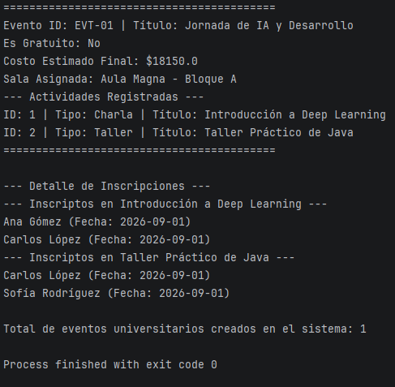
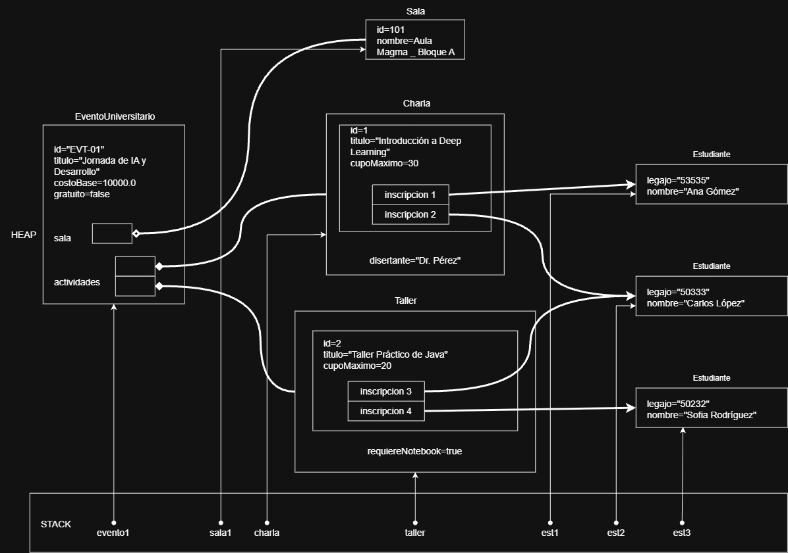

Este repositorio contiene la solución del Trabajo Práctico N° 1. El objetivo del sistema es gestionar Eventos Universitarios, administrando la asignación de salas, la creación de actividades (que pueden ser charlas y talleres) y la inscripción de estudiantes a estas.

Conceptos de POO Aplicados:

Encapsulamiento: control de acceso a datos mediante calificadores (private, public, final).
Herencia y clases abstractas: la clase base modelo.actividad.Actividad define comportamientos genéricos compartidos por las subclases modelo.actividad.Charla y modelo.actividad.Taller.
Polimorfismo: tratamiento unificado de diferentes tipos de actividades al calcular costos y mostrar identificaciones dinámicamente.
Relaciones entre objetos:
Asociación / Inscripción: entre modelo.actividad.Actividad, modelo.Inscripcion y modelo.Estudiante.
Agregación: la clase modelo.Sala existe de forma independiente a modelo.EventoUniversitario.
Composición: las actividades forman parte de la vida útil del modelo.EventoUniversitario.

IMAGENES:
Salida de consola:

Diagrama de memoria Heap & Stack:
