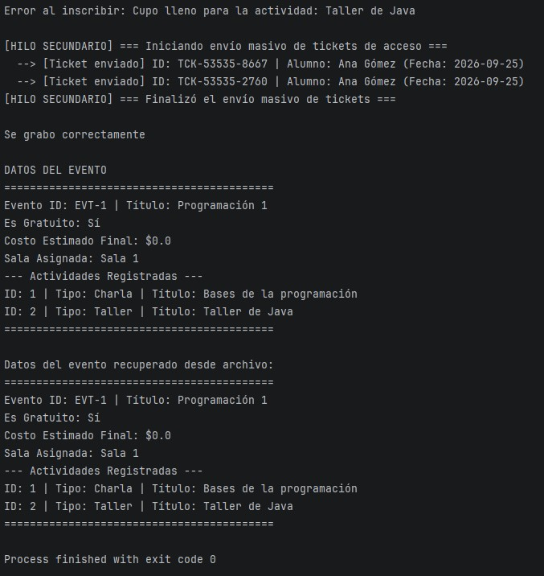

Trabajo Práctico N° 2 - Paradigmas de Programación

Estudiante: Porta Giuliana Jazmin
Legajo: 53833
---
Descripción:
Evolución del sistema de gestión de eventos universitarios con la incorporación de conceptos avanzados de POO en Java:

Excepciones y Persistencia: Control de cupo con `CupoExcedidoException` y serialización de objetos en disco (`.ser`).
Interfaces: Emisión de certificados digitales (`Certificable`) en talleres y cursos.
Generics y Wildcards: Métodos genéricos para filtrado de actividades y cálculo flexible de costos.
Clases Anidadas y Concurrencia: Generación de tickets de acceso e implementación de un hilo secundario (`EnvioTicketsThread`) para envíos masivos.
---
Ejecución del Programa:

